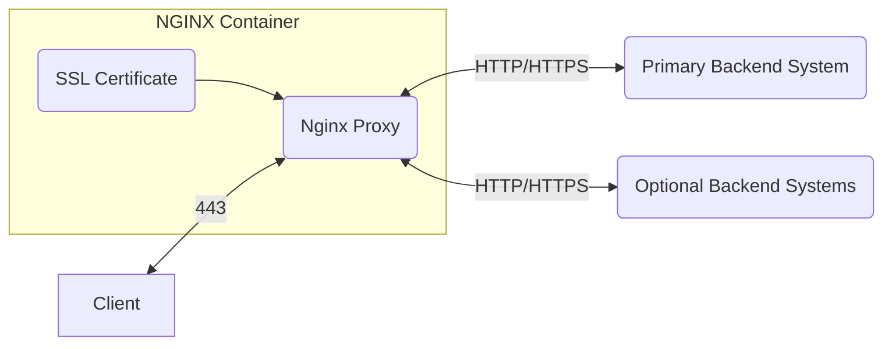

# SSL Enabled Web Proxy

This container proxies web traffic from internal systems with SSL/TLS encryption.

Typical usage would be deployed with a helm chart deployed application in Kubernetes/Docker that does not support SSL natively.



## Container Configuration

The following environmental variables need to be specified:

* HTTPS_PORT - Defaults to port 443 but is the port used by the container to listen to HTTPS requests.

Container volume:

* /ssl - A volume that holds the ssl certificate and key.  The file names must be:  ssl.crt and ssl.key.  Built into the image is a default self signed certificate that may be used if needed, simply don't apply the volume.
* /nginx - A volume containing a set of proxy location configurations.  Each must be named with a file suffix of *.location.  The template is proxy.locations.

## Container Build

```bash
docker build -t registry.stratagemgroup.com/lumos/tools/hardened/nginx-proxy:latest
```

## Sample ENV file

```text
HTTPS_PORT=443
```

## Setting the List of Proxy Locations

Utilize proxy.locations as a template for each location.  At least the root "/" needs to be specified.

## Sample Container Run

```bash
docker run -p 443:443 -v ${PWD}/ssl:/ssl --env-file sample.env registry.stratagemgroup.com/lumos/tools/hardened/nginx-proxy:latest
```

## Sample Docker Compose

```docker
version: '3'
services:
  sslgateway:
    container_name: sslgateway
    image: registry.stratagemgroup.com/lumos/tools/hardened/nginx-proxy:latest
    ports:
      - '443:443'
    environment:
      - HTTPS_PORT=443
      - LOCATIONS=https://arka.org
    volumes:
      - './ssl:/ssl'
      - "./nginx:/etc/nginx/conf.d"
    restart: always
```
